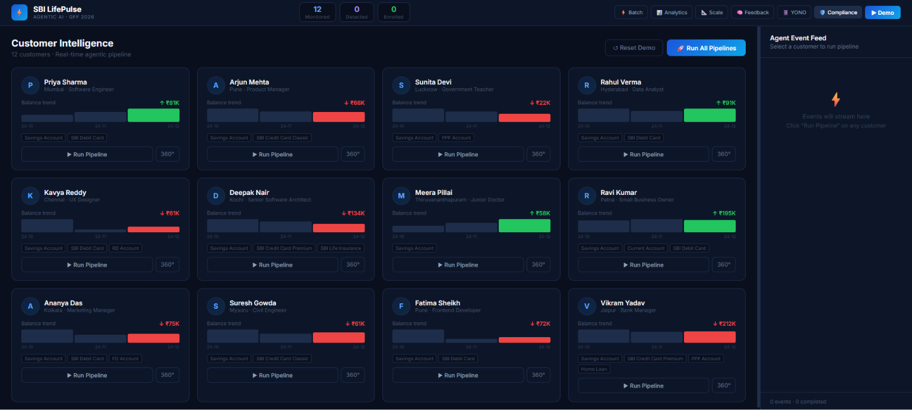
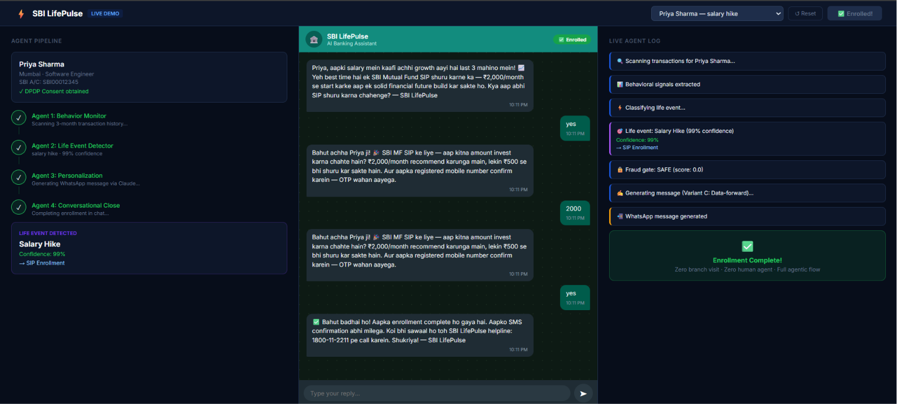
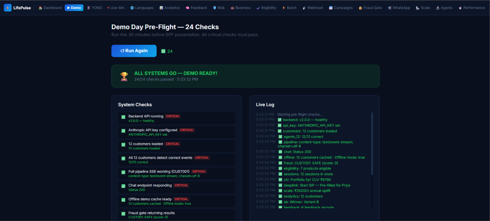

# ⚡ SBI LifePulse — Agentic AI for Proactive Customer Engagement


> 🏆 **SBI Global FinTech Festival (GFF) 2026 Hackathon Submission**

**Team Glucon-D**

**Shivam Lalwani • Aanya Singh**

---

# 🚀 Overview

SBI LifePulse is an **AI-powered multi-agent banking assistant** that proactively detects customer life events from transaction behavior and recommends personalized SBI financial products before customers even search for them.

The platform combines behavioral analytics, multiple AI agents, fraud detection, multilingual communication, and conversational AI to improve customer engagement while ensuring safe and relevant product recommendations.

### Detects events like

- 💍 Marriage
- 👶 New Baby
- 💰 Salary Hike
- 🏡 New EMI
- 🚗 Relocation
- 🛡 Insurance Gap

---

# 📸 Screenshots

## Dashboard



---

## Live Demo



---

## Preflight System Check



---

# ✨ Key Features

- 🤖 Multi-Agent AI Pipeline
- 📈 Behavioral Transaction Analysis
- 💍 Automatic Life Event Detection
- 🌍 Personalized Messages in 8 Languages
- 🛡 Fraud Detection Engine
- ✅ Product Eligibility Engine
- 💬 Conversational AI Assistant
- 📱 YONO Deep Link Generation
- 📊 Customer Analytics Dashboard
- 📲 WhatsApp Integration (Twilio)
- ⚡ Offline Demo Support
- 🚀 FastAPI + Next.js Architecture

---

# 🛠 Tech Stack

## Frontend

- Next.js
- React
- JavaScript

## Backend

- FastAPI
- Python
- Pandas
- SQLite

## AI

- Anthropic Claude
- Rule-Based AI Agents

## DevOps

- Docker
- Docker Compose

---

# ⚡ Quick Start

Clone the repository

```bash
git clone https://github.com/shivamlalwani30/sbi-lifepulse.git

cd sbi-lifepulse
```

Create environment variables

```bash
cp .env.example .env
```

Add your Claude API key

```env
ANTHROPIC_API_KEY=your_api_key
```

Start the backend

```bash
cd backend

pip install -r requirements.txt

uvicorn main:app --reload
```

Start the frontend

```bash
cd frontend

npm install

npm run dev
```

Visit

```
http://localhost:3000
```

---

# 📂 Project Structure

```
backend/
frontend/
docs/
README.md
docker-compose.yml
.env.example
```

---

# 🧠 Multi-Agent Pipeline

```
Behavior Monitor
        │
        ▼
Life Event Detector
        │
        ▼
Eligibility Checker
        │
        ▼
Fraud Detector
        │
        ▼
Personalization Agent
        │
        ▼
Conversation Agent
        │
        ▼
Customer Engagement
```

---

# 📱 Application Modules

## Customer Experience

| Page | Description |
|------|-------------|
| `/` | Dashboard |
| `/demo` | Main Jury Demo |
| `/m` | Mobile Demo |
| `/customer/[id]` | Customer 360° Profile |
| `/yono` | YONO Banking Mockup |

---

## AI Intelligence

| Page | Description |
|------|-------------|
| `/analytics` | Business Analytics |
| `/risk` | Risk Engine |
| `/feedback` | Learning Agent |
| `/multilingual` | Multi-language Messages |
| `/business` | Customer Lifetime Value |

---

## Operations

| Page | Description |
|------|-------------|
| `/batch` | Batch Processing |
| `/campaigns` | Campaign Engine |
| `/fraud` | Fraud Dashboard |
| `/eligibility` | Product Eligibility |
| `/deeplink` | YONO Deep Links |
| `/twilio` | WhatsApp Integration |
| `/webhook` | Finacle Simulator |

---

## Demo Utilities

| Page | Description |
|------|-------------|
| `/agents` | Agent Architecture |
| `/performance` | SLA Benchmark |
| `/pitch` | Jury Pitch Kit |
| `/scale` | Revenue Calculator |
| `/preflight` | System Health Check |
| `/simulate` | Live Customer Simulation |
| `/qr` | QR Code Generator |

---

# 🤖 AI Agents

### Core Agents

- Behavior Monitor
- Life Event Detector
- Personalization Agent
- Conversational Close Agent
- Feedback Loop
- Multilingual Agent

### Support Modules

- Intent Classifier
- Sentiment Tracker
- Eligibility Checker
- Fraud Detector
- Risk Scoring
- Customer Lifetime Value Calculator
- Product Catalog
- YONO Deep Link Generator
- Batch Engine
- Campaign Scheduler
- Session Store
- Demo Cache

---

# 👥 Demo Dataset

The application includes **12 realistic SBI customer profiles** representing six major life events across multiple Indian cities.

Each customer includes:

- Transaction History
- Behaviour Signals
- AI Predictions
- Fraud Score
- Product Eligibility
- Personalized Recommendations

---

# 📊 Project Highlights

| Metric | Value |
|---------|------:|
| AI Agents | 6 |
| Support Modules | 10+ |
| Demo Customers | 12 |
| Languages | 8 |
| Fraud Checks | 6 |
| Eligibility Rules | 8 |
| Pages | 26 |
| Automated Tests | 227 |
| SLA | < 8 Seconds |
| Revenue Opportunity | ₹2,520 Cr/year |

---

# 📱 WhatsApp Integration

Configure Twilio credentials inside `.env`

```env
TWILIO_ACCOUNT_SID=
TWILIO_AUTH_TOKEN=
TWILIO_WHATSAPP_FROM=
TWILIO_DEMO_PHONE=
```

Visit

```
/twilio
```

to send real WhatsApp messages.

---

# 🧪 Preflight

Before every presentation run

```bash
cd backend

python test_suite.py
```

Then visit

```
http://localhost:3000/preflight
```

to verify every system component.

---

# 🌟 Why SBI LifePulse?

Traditional banking is reactive.

SBI LifePulse transforms banking into a proactive AI-driven experience by identifying customer needs before they are explicitly expressed.

It combines intelligent behavioral analysis, multilingual communication, fraud prevention, eligibility verification, and conversational AI into one unified platform capable of operating at SBI's national scale.

---

# 👨‍💻 Team

## Team Glucon-D

### Shivam Lalwani

- Full Stack Development
- AI Integration
- Backend Engineering

### Aanya Singh

- Frontend Development
- UI/UX Design
- Product Presentation

---

# 📜 License

This project is released under the **MIT License**.

---

⭐ If you found this project interesting, consider giving it a **Star**!
